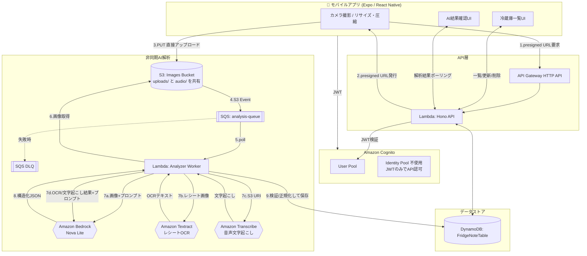

# FridgeNote アーキテクチャ設計書

## 0. 前提と最優先制約

| 制約 | 内容 |
|---|---|
| コスト | 月額 1,000円以下(約 $6.5) |
| ユーザー数 | 約5人(想定トラフィックは極小) |
| AI推論 | 自前GPUサーバー運用禁止。Amazon Bedrock (サーバーレス/オンデマンド) のみ |
| クライアント | iOS / Android (Expo + React Native の単一コードベース) |

上記4点を満たすため、**常時稼働リソースを一切持たない完全サーバーレス構成**とする。
EC2 / RDS / ECS(Fargateの常時起動含む) / NAT Gateway / カスタムドメイン(Route53+ACM) は使用しない。

## 1. システム構成図(全体)

## 2. 認証フロー

- Cognito User Pool でサインアップ/サインイン(メール+パスワード、または将来的にSNS連携)。
- モバイルは Amplify Auth もしくは `amazon-cognito-identity-js` で ID Token(JWT) を取得。
- API Gateway HTTP API の **JWT Authorizer** (Cognito User Pool をIssuerに設定) をルートに適用し、Lambda到達前にJWTを検証。
- Lambda(Hono)側でも `event.requestContext.authorizer.jwt.claims.sub` から `userId` を取得し、**クライアントが送ってきた `userId` は一切信用しない**。すべてのDB操作はこの `sub` を使う。
- Identity Pool(AWS認証情報付与)は使わない。S3 Presigned URLはバックエンドのLambda実行ロールで署名して払い出すため、モバイル側にAWS権限を持たせる必要がない → IAM設計がシンプルになりセキュリティ面でも有利。
- CORSはAPI Gateway HTTP APIの`cors_configuration`(`infra/apigateway.tf`、`var.cors_allowed_origins`)だけで完結させる。HTTP APIはプリフライト(OPTIONS)をAPI Gateway層で処理し実レスポンスへもヘッダーを付与するため、Lambda(Hono)側に別途CORSミドルウェアを重ねる必要はなく、むしろ許可オリジンの設定元が2箇所に分散する原因になる(以前はHono側にも`cors()`があったため撤去した)。

## 3. 画像アップロード & AI解析フロー(詳細)

1. モバイルは撮影後、`expo-image-manipulator` で **長辺1280px程度・JPEG quality 0.6〜0.7** にリサイズ圧縮(Bedrockコスト and S3コスト削減の要)。
2. `POST /v1/images/presigned-url` を呼び、`{ imageKey, uploadUrl, expiresIn }` を受け取る。
   - `imageKey` は `users/{sub}/uploads/{uuid}.jpg` の形式。**必ずパスに `sub` を含め**、他ユーザーの領域へのアップロードをバックエンド側で拒否する。
   - Presigned URLの有効期限は **60秒**。
3. モバイルは受け取ったURLへ直接 `PUT`(Content-Type固定、`Content-Length`はS3側条件で範囲チェック)。
4. S3 `ObjectCreated` イベント → 直接SQS(`analysis-queue`)へメッセージ投入(SNS経由にしない。ファンアウト先が1つのみのため)。
5. Analyzer Worker Lambda がSQSをポーリング(バッチサイズ1〜5)。
6. `imageKey` から `analysisId` を決定論的に生成(例: `sha256(imageKey)` の先頭16文字)し、DynamoDBへ `attribute_not_exists(PK)` 条件付きで `status=processing` を書き込む → **重複メッセージ/再送は自然に弾かれる(冪等性)**。
7. S3からオブジェクトを取得し、Base64化してBedrockへ送信(画像はプロンプトとJSON Schema付きで送る)。
8. Bedrockのレスポンスを **Zodスキーマで厳格にバリデーション**。不正な場合は `status=failed` とし、DLQには流さず正常終了(バリデーション失敗はリトライしても直らないため)。
9. 食材名をマスターに正規化(ひらがな/カタカナ/英語表記ゆれを吸収)。
10. `ImageAnalysis.result` を更新し `status=completed`。
11. モバイルは `GET /v1/analyses/:id` をポーリング(3秒間隔・最大30回程度)して結果を取得。
12. ユーザーが確認・修正 → `POST /v1/fridge/items`(食材登録)または `POST /v1/fridge/consume`(在庫減算)を呼んで初めてFridgeItemが変更される。**AIの出力を直接DBの確定データとして書き込む経路は存在しない**。

### 3.1 レシート撮影フロー

`type=receipt` で `POST /v1/analyses` を呼ぶ以外は上記と同じ経路(新しいAPI/Lambda/キューは作らない)。
Analyzer Worker内で分岐が増える:

1. S3からレシート画像を取得。
2. **Amazon Textract**(`DetectDocumentText`、同期API)でOCRテキストを抽出。
   非同期ジョブAPIではなく同期APIを選んだ理由: レシート1枚程度のテキスト量なら数秒で返り、
   Lambdaのタイムアウト予算内に収まるため、ポーリングの複雑さを増やす非同期APIは不要と判断。
3. OCRテキストをBedrockに渡し、`{ items: [{ name, quantity, unit, confidence }] }` の構造化JSONを取得
   (税抜金額・洗剤等の非食品はプロンプトで除外するよう指示)。
4. 各itemを食材マスターへ正規化し、`belowConfidenceThreshold`(既定0.6未満)を算出して
   `ImageAnalysis.result = { kind: "receipt", items: [...] }` として保存。
5. モバイルはチェックリストで確認し、`POST /v1/fridge/items/bulk` で一括登録する。

### 3.2 音声入力フロー

画像ではなく音声のため、`ImageAnalysis` とは別の `VoiceAnalysis` エンティティ・別エンドポイントを使うが、
**S3イベント→SQS→Analyzer Workerという同じ非同期基盤を共有する**(音声専用のキュー/Workerは作らない。
Analyzer WorkerがS3オブジェクトキーのプレフィックス `users/{sub}/audio/` か `users/{sub}/uploads/` かで分岐する)。

1. モバイルは録音した音声(m4a)を `POST /v1/images/presigned-url`(`contentType: "audio/m4a"`)で
   払い出された`audio/`プレフィックスのPresigned URLへPUTアップロード。
2. `POST /v1/voice/transcriptions` でジョブを作成(`audioKey`が呼び出しユーザーの名前空間内かを検証)。
3. S3イベントでAnalyzer Workerが起動 → **Amazon Transcribe**(`StartTranscriptionJob`→ポーリングで
   `GetTranscriptionJob`)で文字起こし。出力先はAWS管理のデフォルトバケットを使い(専用出力バケットを
   作らずコストと設定を最小化)、完了後 `TranscriptFileUri` をHTTPで取得してテキストを得る。
   ジョブ名は呼び出しのたびに一意な値(`fridgenote-{keyのハッシュ}-{timestamp}`)にする
   (Transcribeのジョブ名はAWSアカウント内で一意である必要があり、SQS再配信で同じ音声に対して
   複数回ジョブ作成を試みても`ConflictException`にならないようにするため。冪等性自体は
   DynamoDBの条件付き書き込み側で担保している)。
4. 文字起こしテキストをBedrockに渡し、レシートと同じ `{ items: [...] }` 形式の構造化JSONを取得。
5. `VoiceAnalysis.result` を更新し `status=completed`。モバイルは `GET /v1/voice/transcriptions/:id`
   をポーリングし、レシートと同じチェックリストUI・同じ `POST /v1/fridge/items/bulk` で一括登録する
   (確認〜一括登録のUI/APIをレシートと共通化し、二重実装を避けている)。

### 冪等性・エラー処理まとめ

| 事象 | 対処 |
|---|---|
| 同じ画像の再送信 | `imageKey`ごとに一意の`analysisId`。既存レコードがあればそれを返す |
| S3イベント重複配信 | 条件付き書き込みで2重処理を防止 |
| SQS Visibility Timeout超過 | Lambdaのタイムアウト(30秒)より長く設定(90秒)。処理中に再受信されても冪等書き込みで実害なし |
| Bedrockの一過性エラー(秒間ThrottlingException・タイムアウト等) | 3回まで指数バックオフ(300ms/600ms/1200ms)で再試行 → それでも失敗すれば`status=failed`(`errorReason`はprocessing_error)とし例外を再スロー → SQS再配信(最大3回)→ 最終的にDLQ |
| Bedrockの致命的エラー(`AccessDeniedException`/`ValidationException`/`ResourceNotFoundException`/`UnrecognizedClientException`、および**日次トークンクォータ超過**=`ThrottlingException`で"Too many tokens per day"を含むもの) | **ローカルリトライすらせず即座に`AiFatalError`として`status=failed`**(`errorReason`は`bedrock_quota_exceeded`等の専用値)にし、**例外を再スローしない**(SQS再配信させない)。これらは何度リトライしても同じ理由で必ず失敗し、日次クォータ超過の場合は再配信のたびに枯渇したクォータをさらに消費してしまうため、他のThrottlingExceptionとは明確に区別している |
| SQSメッセージ自体の処理異常(Lambda例外) | maxReceiveCount=3 → 超過でDLQへ。DLQ滞留数をCloudWatchでアラーム |
| S3アップロード成功後、クライアントが`POST /v1/analyses`(または`/v1/voice/transcriptions`)を結局呼ばなかった(アプリを閉じた・通信断等) | S3イベントは発火するがDynamoDBレコードが無いため、最初の数回は「まだ来ていないだけ」として通常通り再試行するが、SQSの最終配信試行(`ApproximateReceiveCount`がmaxReceiveCountに到達)でも見つからなければ諦めて正常終了する(DLQへは送らない)。何も問題が起きていないのにDLQ滞留アラームを鳴らし続け、本当の異常を見逃す(アラート疲れ)のを避けるため |
| AIレスポンスのJSON不正 | Zodでバリデーション失敗 → `status=failed`理由を記録、DLQ送りにしない(再試行しても直らないため無限リトライを避ける) |
| 重複ジョブ(同時に2つのSQSメッセージ) | DynamoDB条件付き書き込みで後勝ちを防止 |

#### Bedrock呼び出し1回あたりの最大増幅の考え方

「一過性エラー」はLambda内3回×SQS再配信3回=最大9回のBedrock呼び出しになり得るが、これは意図的な設計
(一時的なリージョン障害等が数分後には回復している可能性に賭けた冗長性)。一方「致命的エラー」は
上記の通りSQS再配信自体を起こさないため1回のS3イベントにつき最大1回のBedrock呼び出しで確定し、
このクラスのエラーで無駄にAPIコール数・トークンを消費することはない。

## 4. AWS構成一覧とコスト試算(5ユーザー/月)

| サービス | 用途 | 課金モデル | 月額目安 |
|---|---|---|---|
| Cognito User Pool | 認証 | MAU 50,000まで無料 | ¥0 |
| API Gateway (HTTP API) | REST API | リクエスト課金($1/100万件) | ¥0〜数十円 |
| Lambda (API + Worker) | 実行 | リクエスト+実行時間課金、無料枠(100万リクエスト/月)内 | ¥0〜数十円 |
| DynamoDB | 永続化 | オンデマンド、無料枠(25GB等)内 | ¥0〜数十円 |
| S3 | 画像一時保存 | 保存量小(30日で自動削除)+リクエスト課金 | 数十円 |
| SQS | 非同期キュー | 無料枠(100万リクエスト/月) | ¥0 |
| Bedrock (Nova Lite等) | 画像/レシート/音声のテキスト解析 | 入出力トークン課金(1回あたり画像1枚 or 短文+短文) | 5人×数回/日でも数十〜100円程度 |
| Textract | レシートOCR(同期API) | ページ数課金($1.50/1,000ページ相当) | 5人×週数回程度なら¥10未満 |
| Transcribe | 音声文字起こし | 秒課金($0.024/分)。1回数十秒想定 | 5人×数回/日でも¥50未満 |
| CloudTrail | 監査ログ(管理イベントのみ) | リージョンにつき1証跡までの管理イベント記録は無料枠 | ¥0 |
| CloudWatch Logs | 監視 | 保持14日、ログ量小 | 数十円 |
| **合計** | | | **概ね ¥250〜600/月**、余裕を持って¥1,000以下に収まる |

コストを増大させる典型的な落とし穴として以下は明示的に避ける:
- Lambdaを VPC 内に置く(NAT Gateway ¥4,500〜/月)
- API Gateway REST API + カスタムドメイン(ACM証明書自体は無料だがRoute53ホストゾーンが$0.50/月×常時)
- DynamoDB Provisioned Capacity の据え置き
- S3にライフサイクルルールを設定せず画像を溜め続ける
- Bedrockで大型モデル(Claude Opus等)を画像解析に常用する

## 5. IAM最小権限方針

- API Lambda実行ロール: DynamoDB(自テーブルのみ、Fine-Grained Access ControlでPK先頭が`USER#`の項目のみに制限するアプリ側チェックと併用)、S3(`PutObject`用Presigned URL署名権限は`s3:PutObject`のみ、対象バケットのみ)。
- Worker Lambda実行ロール: S3 `GetObject`(対象バケットのみ)、DynamoDB読み書き、Bedrock `InvokeModel`(対象モデルARNのみ)、
  Textract `DetectDocumentText`、Transcribe `StartTranscriptionJob`/`GetTranscriptionJob`
  (Textract/Transcribeはどちらもリソースレベル権限に対応していないAPIのため`Resource: "*"`が必須。
  そのぶんアクションを個別の読み取り専用API単位まで絞り込んでいる)、
  SQS `ReceiveMessage/DeleteMessage/ChangeMessageVisibility`。
- Secrets Manager / SSM Parameter Store: Bedrockのモデルidやしきい値等の設定値を保持(APIキー的な機密情報は基本的にIAMロールで代替されるため最小限)。
- CloudTrail: 管理イベントのみを記録する単一リージョンの証跡を1つ作成(`infra/cloudtrail.tf`)。
  データイベント(S3オブジェクト単位のGet/Put等)は課金対象かつ本規模では監査上の必要性も薄いため有効化しない。

## 6. AI Adapter / Service構成(将来の実装差し替えに備えた設計)

`backend/src/services/ai/` に用途ごとのインターフェースを定義し、Bedrock/Textract/Transcribeを使う
「本番実装」と、テストで使う「Mock実装」の両方を用意している。テストではモック実装のみを使い、
**実際のBedrock/Textract/Transcribeを呼び出すことはない**。

| インターフェース | 本番実装 | Mock実装 | 用途 |
|---|---|---|---|
| `VisionAIService` | `BedrockVisionAdapter` | (テスト内で個別にモック) | 食材/料理画像の認識 |
| `OcrService` | `TextractOcrService` | `MockOcrService` | レシート画像のOCR |
| `TranscriptionService` | `TranscribeTranscriptionService` | `MockTranscriptionService` | 音声の文字起こし |
| `ReceiptAnalysisService` | `BedrockReceiptAnalysisService` | `MockReceiptAnalysisService` | OCRテキスト→構造化食材リスト |
| `VoiceAnalysisService` | `BedrockVoiceAnalysisService` | `MockVoiceAnalysisService` | 文字起こしテキスト→構造化食材リスト |
| `IngredientSearchService` | `AliasIngredientSearchService` | (実装自体がAI非依存の文字列マッチングのため単一実装) | 食材名の曖昧検索・正規化 |

Bedrockを呼ぶ3つのService(Vision/Receipt/Voice)は、リトライ・タイムアウト・Tool Use呼び出しといった
共通ロジックを `bedrockToolInvoker.ts` に1箇所へ集約している(同じロジックを3箇所にコピーしない)。

将来、自前推論API(SageMaker等)や別のOCR/音声認識サービスに切り替える場合は、
該当インターフェースを満たす別Adapterを追加し、DIで差し替えるのみで済む構成とする。

### IngredientSearchService・食材マスター解決の段階的設計

食材名のあいまい検索(手動入力のサジェスト、レシート/音声結果の食材マスターへの正規化)は、
現状 `AliasIngredientSearchService` が「完全一致→別名一致→部分一致」の順にスコアリングする
文字列ベースの実装(食材マスター全件をメモリにロードして検索)になっている。
OpenSearch/ベクターDBは、5ユーザー規模・食材マスター数百件程度の現状では
運用コスト(OpenSearch Serverlessは最低でも月$700程度〜)に見合わないため導入しない。
`IngredientSearchService` インターフェースの背後にある実装を差し替えるだけで、
将来的に埋め込みベクター検索等へ移行できる設計にしてある。

完全一致・別名(alias)完全一致の判定は、レシート/音声結果を食材マスターへ正規化する
`resolveIngredientId`(ingredientMaster.ts)と、この検索サービスの両方が必要とするため、
`loadIngredientIndex()`が返すMap(正規化名→食材、正規化alias→食材)を共有している
(以前は同じ線形スキャンによる判定ロジックを2箇所に個別実装していた)。これにより
完全一致・alias一致の判定はO(1)になる(部分一致だけは任意の部分文字列同士の比較のため
引き続き全件スキャンする)。

食材マスターへの新規登録は、`ingredientId`を正規化名のSHA256から決定論的に導出し
(`ingredient_<hash>`)、DynamoDBの条件付き書き込みで重複作成を防いでいる(詳細は
[docs/dynamodb-design.md](dynamodb-design.md)のIngredient節)。レシート/音声の一括登録は
複数食材をまとめて並列処理するため、同じ未登録食材名が同時に複数リクエストへ渡ることがあり、
ランダムID採番のままだと食材マスターに重複行ができてしまう問題があった。

## 7. ログ基盤(構造化ログ)

以前は各所が `console.log("メッセージ", 値1, 値2)` のように自由形式でログを出しており、
CloudWatch Logs Insightsで「特定のanalysisIdの一連の処理を追う」「エラー理由(errorReason)
ごとに件数を集計する」といったクエリが書きづらかった。`backend/src/lib/logger.ts` に
構造化ログ基盤を1本化し、API Lambda・Analyzer Worker Lambdaの両方から同じ形で使う。

- **1行=1つのJSONオブジェクト**。`{ timestamp, level, message, functionName, ...文脈フィールド }`
  という一貫した形式で出力し、CloudWatch Logs Insightsで `fields errorReason | stats count() by errorReason`
  のような集計クエリが書けるようにする。
- **`logger.child({ analysisId, userId, ... })`** で文脈を束縛した子ロガーを作れる。
  Analyzer Workerでは1つの解析ジョブの処理開始時に `analysisId`/`userId`/`imageKey`(or `audioKey`)を
  束縛した子ロガーを作り、以降そのジョブに関する全ログ行に自動的にこれらが付与されるようにしている
  (呼び出しのたびに同じフィールドを書く手間・書き漏れを防ぐ)。
- **ログレベルは`LOG_LEVEL`環境変数**(Terraform変数 `log_level`、既定`info`)で絞り込める。
  障害調査時に `terraform apply -var="log_level=debug"` のようにコード変更・再デプロイなしで
  詳細ログへ切り替えられる。
- 依存ライブラリを追加しない(Lambdaのコールドスタート・バンドルサイズへの影響を避けるため、
  pino/winston等は導入せず、標準の`console.log`/`console.error`へJSON文字列を渡すだけの実装)。
- Bedrock呼び出しは `bedrockToolInvoker.ts` で試行ごとに `bedrock_invocation_succeeded` /
  `bedrock_invocation_retrying` / `bedrock_invocation_fatal` 等のログを出し、`inputTokens`/
  `outputTokens`/`durationMs`も記録する。Textract/Transcribeも同様に開始・成功・失敗をログに残す。
  これにより「いつ・どのくらいの頻度で・どのエラー理由で」Bedrock呼び出しが失敗しているかを
  CloudWatch Logs Insightsから追えるようにしている(今回のBedrock日次トークンクォータ超過調査を
  踏まえた追加)。
