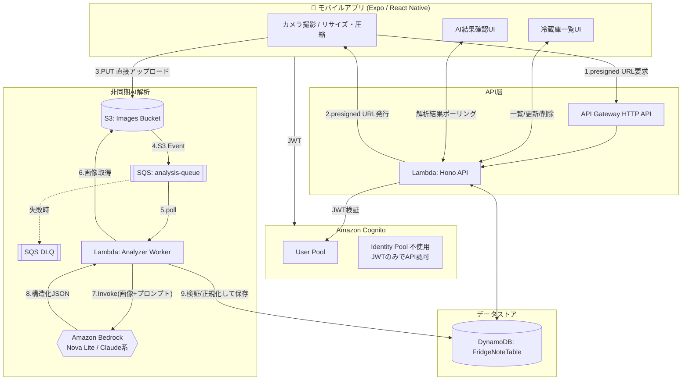

# FridgeNote アーキテクチャ設計書

## 0. 前提と最優先制約

| 制約 | 内容 |
|---|---|
| コスト | 月額 1,000円以下(約 $6.5) |
| ユーザー数 | 約5人(想定トラフィックは極小) |
| AI推論 | 自前GPUサーバー運用禁止。Amazon Bedrock (サーバーレス/オンデマンド) のみ |
| クライアント | iOS / Android (Expo + React Native の単一コードベース) |

上記4点を満たすため、**常時稼働リソースを一切持たない完全サーバーレス構成**とする。
EC2 / RDS / ECS(Fargateの常時起動含む) / NAT Gateway / カスタムドメイン(Route53+ACM) は使用しない。

## 1. システム構成図(全体)

## 2. 認証フロー

- Cognito User Pool でサインアップ/サインイン(メール+パスワード、または将来的にSNS連携)。
- モバイルは Amplify Auth もしくは `amazon-cognito-identity-js` で ID Token(JWT) を取得。
- API Gateway HTTP API の **JWT Authorizer** (Cognito User Pool をIssuerに設定) をルートに適用し、Lambda到達前にJWTを検証。
- Lambda(Hono)側でも `event.requestContext.authorizer.jwt.claims.sub` から `userId` を取得し、**クライアントが送ってきた `userId` は一切信用しない**。すべてのDB操作はこの `sub` を使う。
- Identity Pool(AWS認証情報付与)は使わない。S3 Presigned URLはバックエンドのLambda実行ロールで署名して払い出すため、モバイル側にAWS権限を持たせる必要がない → IAM設計がシンプルになりセキュリティ面でも有利。

## 3. 画像アップロード & AI解析フロー(詳細)

1. モバイルは撮影後、`expo-image-manipulator` で **長辺1280px程度・JPEG quality 0.6〜0.7** にリサイズ圧縮(Bedrockコスト and S3コスト削減の要)。
2. `POST /v1/images/presigned-url` を呼び、`{ imageKey, uploadUrl, expiresIn }` を受け取る。
   - `imageKey` は `users/{sub}/uploads/{uuid}.jpg` の形式。**必ずパスに `sub` を含め**、他ユーザーの領域へのアップロードをバックエンド側で拒否する。
   - Presigned URLの有効期限は **60秒**。
3. モバイルは受け取ったURLへ直接 `PUT`(Content-Type固定、`Content-Length`はS3側条件で範囲チェック)。
4. S3 `ObjectCreated` イベント → 直接SQS(`analysis-queue`)へメッセージ投入(SNS経由にしない。ファンアウト先が1つのみのため)。
5. Analyzer Worker Lambda がSQSをポーリング(バッチサイズ1〜5)。
6. `imageKey` から `analysisId` を決定論的に生成(例: `sha256(imageKey)` の先頭16文字)し、DynamoDBへ `attribute_not_exists(PK)` 条件付きで `status=processing` を書き込む → **重複メッセージ/再送は自然に弾かれる(冪等性)**。
7. S3からオブジェクトを取得し、Base64化してBedrockへ送信(画像はプロンプトとJSON Schema付きで送る)。
8. Bedrockのレスポンスを **Zodスキーマで厳格にバリデーション**。不正な場合は `status=failed` とし、DLQには流さず正常終了(バリデーション失敗はリトライしても直らないため)。
9. 食材名をマスターに正規化(ひらがな/カタカナ/英語表記ゆれを吸収)。
10. `ImageAnalysis.result` を更新し `status=completed`。
11. モバイルは `GET /v1/analyses/:id` をポーリング(3秒間隔・最大30回程度)して結果を取得。
12. ユーザーが確認・修正 → `POST /v1/fridge/items`(食材登録)または `POST /v1/fridge/consume`(在庫減算)を呼んで初めてFridgeItemが変更される。**AIの出力を直接DBの確定データとして書き込む経路は存在しない**。

### 冪等性・エラー処理まとめ

| 事象 | 対処 |
|---|---|
| 同じ画像の再送信 | `imageKey`ごとに一意の`analysisId`。既存レコードがあればそれを返す |
| S3イベント重複配信 | 条件付き書き込みで2重処理を防止 |
| SQS Visibility Timeout超過 | Lambdaのタイムアウト(30秒)より長く設定(90秒)。処理中に再受信されても冪等書き込みで実害なし |
| Bedrock APIエラー/タイムアウト | 3回まで指数バックオフで再試行 → 最終失敗で`status=failed`、DLQには送らない(ユーザーへ「手動登録」を促す) |
| SQSメッセージ自体の処理異常(Lambda例外) | maxReceiveCount=3 → 超過でDLQへ。DLQ滞留数をCloudWatchでアラーム |
| AIレスポンスのJSON不正 | Zodでバリデーション失敗 → `status=failed`理由を記録、DLQ送りにしない(再試行しても直らないため無限リトライを避ける) |
| 重複ジョブ(同時に2つのSQSメッセージ) | DynamoDB条件付き書き込みで後勝ちを防止 |

## 4. AWS構成一覧とコスト試算(5ユーザー/月)

| サービス | 用途 | 課金モデル | 月額目安 |
|---|---|---|---|
| Cognito User Pool | 認証 | MAU 50,000まで無料 | ¥0 |
| API Gateway (HTTP API) | REST API | リクエスト課金($1/100万件) | ¥0〜数十円 |
| Lambda (API + Worker) | 実行 | リクエスト+実行時間課金、無料枠(100万リクエスト/月)内 | ¥0〜数十円 |
| DynamoDB | 永続化 | オンデマンド、無料枠(25GB等)内 | ¥0〜数十円 |
| S3 | 画像一時保存 | 保存量小(30日で自動削除)+リクエスト課金 | 数十円 |
| SQS | 非同期キュー | 無料枠(100万リクエスト/月) | ¥0 |
| Bedrock (Nova Lite等) | 画像解析 | 入出力トークン課金(1回あたり画像1枚+短文) | 5人×数回/日でも数十〜100円程度 |
| CloudWatch Logs | 監視 | 保持14日、ログ量小 | 数十円 |
| **合計** | | | **概ね ¥200〜500/月**、余裕を持って¥1,000以下に収まる |

コストを増大させる典型的な落とし穴として以下は明示的に避ける:
- Lambdaを VPC 内に置く(NAT Gateway ¥4,500〜/月)
- API Gateway REST API + カスタムドメイン(ACM証明書自体は無料だがRoute53ホストゾーンが$0.50/月×常時)
- DynamoDB Provisioned Capacity の据え置き
- S3にライフサイクルルールを設定せず画像を溜め続ける
- Bedrockで大型モデル(Claude Opus等)を画像解析に常用する

## 5. IAM最小権限方針

- API Lambda実行ロール: DynamoDB(自テーブルのみ、Fine-Grained Access ControlでPK先頭が`USER#`の項目のみに制限するアプリ側チェックと併用)、S3(`PutObject`用Presigned URL署名権限は`s3:PutObject`のみ、対象バケットのみ)。
- Worker Lambda実行ロール: S3 `GetObject`(対象バケットのみ)、DynamoDB読み書き、Bedrock `InvokeModel`(対象モデルARNのみ)、SQS `ReceiveMessage/DeleteMessage/ChangeMessageVisibility`。
- Secrets Manager / SSM Parameter Store: Bedrockのモデルidやしきい値等の設定値を保持(APIキー的な機密情報は基本的にIAMロールで代替されるため最小限)。

## 6. 将来の自前AI推論への置き換えに備えた設計

`backend/src/services/ai/` に `VisionAnalysisAdapter` インターフェースを定義し、`BedrockVisionAdapter` を実装。
将来、自前推論API(SageMaker等)に切り替える場合は同インターフェースを満たす別Adapterを追加し、DIで差し替えるのみで済む構成とする。
